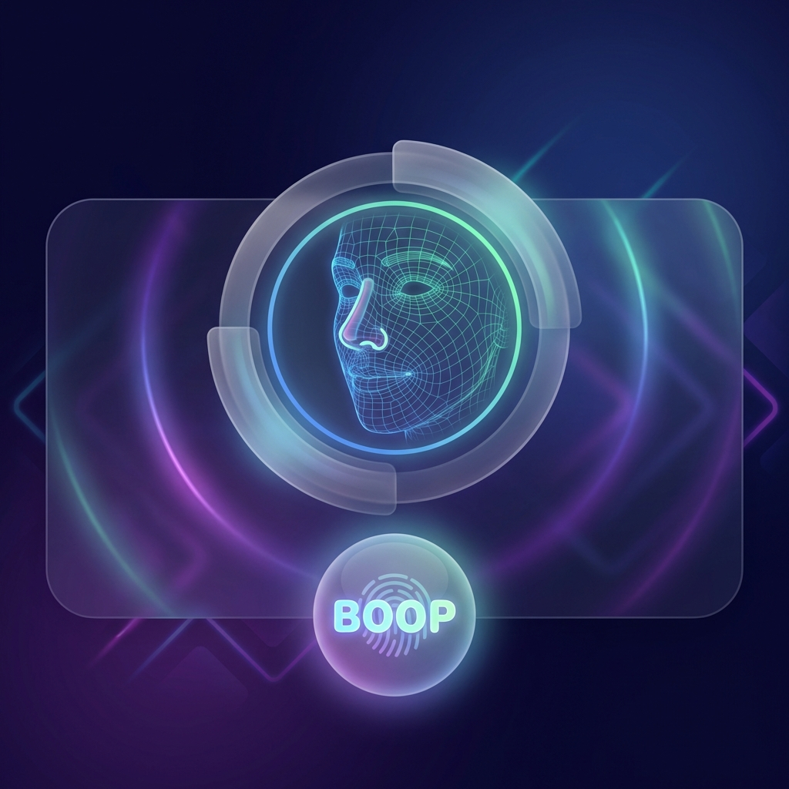
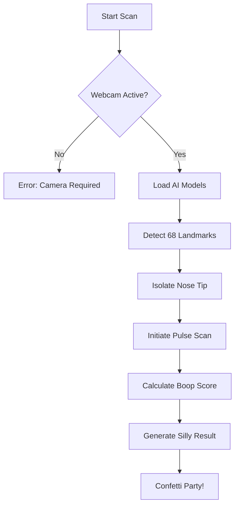

  

# Nose Scanner 3000 — Elite Boop Protocol 👃✨

> "The most accurate, silly, and futuristic way to prove you have a nose."

A playful, responsive single-page application that simulates high-tech biometric "nose verification". It's not real security—it's **Elite Boop Science™**.

---

## 🌟 Key Features

- **🌈 Neon-Glow UI**: A futuristic aesthetic with glassmorphism, soft shadows, and buttery-smooth micro-interactions.
- **👁️ 3D Wireframe Mesh**: Real-time triangulated face tracking using 68 facial landmarks.
- **📡 Subnautica-Inspired Scanning**: A pulsing 5-second scan with progress bars, beams, and status updates.
- **🔍 Precision Nose Tracking**: Specifically identifies the nose bridge and tip for maximum "verification" accuracy.
- **🎭 Randomized Results**: From "Legendary Nose" (0.7% chance!) to "Drama Sensor".
- **🔒 Privacy First**: All detection happens on your device. Your face never leaves the browser.

---

## 🛠️ How It Works (The "Science")

The scanning process is a complex orchestration of AI and visual flair.

<b>📂 Technical Implementation Details</b>

- **Face Detection**: Powered by `TensorFlow.js` and `face-api.js` (Tiny Face Detector).
- **Scanning Logic**: Custom `requestAnimationFrame` loop driving the progress and status messages.
- **Audio**: Web Audio API for synthetic start/success/fail beeps + Subnautica-inspired scan loop.
- **Visuals**: Canvas API for the 3D wireframe mesh and high-performance confetti.
- **Zoom Flow**: CSS transitions for the futuristic 1.5x scanner zoom effect.

---

## 🚀 Boop Protocol (Usage)

1. **Ignition**: Open `index.html` in your favorite modern browser.
2. **Permission**: Click **"Use Webcam"** and permit the scanner to behold your nose.
3. **Execution**: Position your nose in the target area and hit **"Scan Nose"** (or smash **Enter**).
4. **Verification**: Wait 5 seconds for the AI to "analyze" your boop-worthiness.
5. **Celebration**: Share your result and try to aim for that **Legendary** status!

---

## 📄 Privacy Statement

This application is purely cosmetic and for entertainment purposes.
- **No Uploads**: No images, video frames, or landmark data are ever sent to a server.
- **No Persistence**: Nothing is stored in `localStorage` or cookies regarding your face.
- **Open Source**: The code is as transparent as a clean nostril.

---

  <i>Made with ❤️ for the 9th Expo. Please boop responsibly.</i>

